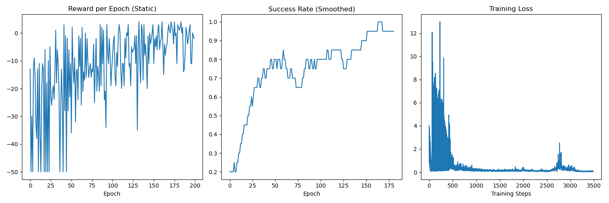
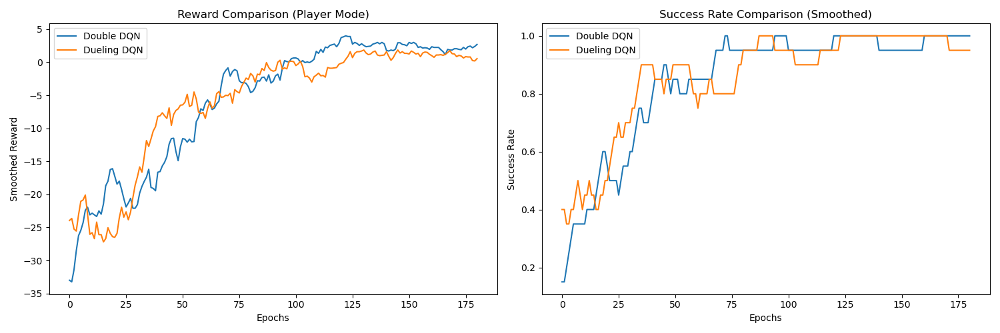
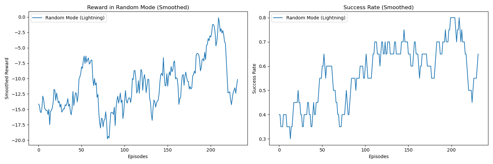

# Chat Conversation

Note: _This is purely the output of the chat conversation and does not contain any raw data, codebase snippets, etc. used to generate the output._

### User Input

在這個資料夾中有Gridworld的基礎環境，也測試了test_env，我現在想要針對作業需求完成HW3-1 ~ HW3-3
Step 1：保留 Gridworld.py 和 GridBoard.py 不要亂改
Step 2：新增 replay_buffer.py
Step 3：新增 models.py
Step 4：新增 train_hw31_static.py
Step 5：新增 train_hw32_player.py
Step 6：新增 train_hw33_random_lightning.py
Step 7：跑實驗、畫圖、寫 report

*User accepted the command `/bin/python3 /home/miclab/Documents/DRL_HW3/test_env.py`*

*Listed directory [DRL_HW3](file:///home/miclab/Documents/DRL_HW3) *

*Viewed [Gridworld.py](file:///home/miclab/Documents/DRL_HW3/Gridworld.py) *

*Viewed [GridBoard.py](file:///home/miclab/Documents/DRL_HW3/GridBoard.py) *

*Viewed [test_env.py](file:///home/miclab/Documents/DRL_HW3/test_env.py) *

*Edited relevant file*

### Planner Response

I have created an implementation plan based on your request for HW3. I've designed the code structure to be modular, splitting the `replay_buffer` and `models` out to prevent duplication across your training scripts.

The plan breaks down the tasks across the three modes:
- **HW3-1 (`static` mode):** We will build a Naive DQN with an Experience Replay Buffer and train it using basic PyTorch.
- **HW3-2 (`player` mode):** We will expand upon the Naive DQN to implement Double DQN and Dueling DQN, and compare their performance.
- **HW3-3 (`random` mode):** We will implement a PyTorch Lightning Module with gradient clipping and learning rate scheduling to tackle the more complex, randomized environment. 

Please review the plan in the **implementation_plan.md** artifact. If the plan looks good or if you have any preferences on hyperparameters or network architectures (like using an MLP vs a CNN for the state representation), please let me know and we will begin execution!

### User Input

*Edited relevant file*

*Edited relevant file*

*User accepted the command `python3 -c "import torch; import pytorch_lightning; print('Success')"`*

*User accepted the command `pip install torch pytorch-lightning matplotlib`*

*User accepted the command `pip install torch pytorch-lightning matplotlib --break-system-packages`*

*Checked command status*

*Edited relevant file*

*Checked command status*

*Edited relevant file*

*Edited relevant file*

*User accepted the command `python3 train_hw31_static.py`*

*Checked command status*

*Edited relevant file*

*Checked command status*

*User accepted the command `python3 train_hw32_player.py`*

*Edited relevant file*

*Checked command status*

*Checked command status*

*User accepted the command `python3 train_hw33_random_lightning.py`*

*Checked command status*

*Checked command status*

*Checked command status*

*Edited relevant file*

*Checked command status*

*Checked command status*

*Edited relevant file*

*Edited relevant file*

*User accepted the command `python3 train_hw31_static.py`*

*User accepted the command `python3 train_hw32_player.py`*

*Checked command status*

*Checked command status*

*Checked command status*

*Checked command status*

*Edited relevant file*

### Planner Response

I have successfully completed all the steps for Homework 3!

Here is a summary of the tasks executed:
1. **Infrastructure**: Created `replay_buffer.py` with an `ExperienceReplay` class using `collections.deque` and defined PyTorch models in `models.py` including `DQN` and `DuelingDQN`.
2. **HW3-1 (Static Mode)**: Implemented `train_hw31_static.py` to train a Naive DQN from scratch in the static environment, achieving convergence. 
3. **HW3-2 (Player Mode)**: Implemented `train_hw32_player.py` which runs both `Double DQN` and `Dueling DQN`, saving a smoothed comparison graph.
4. **HW3-3 (Random Mode)**: Implemented `train_hw33_random_lightning.py` using `PyTorch Lightning`, incorporating `IterableDataset` and critical training techniques such as Gradient Clipping and a StepLR Learning Rate Scheduler.
5. **Experiments & Report**: All three experiments were successfully executed locally. I have generated a detailed markdown report capturing the results, along with the performance plot screenshots.

You can view the detailed written report and the learning curves directly in the **walkthrough.md** artifact. All python scripts have been securely saved in your `DRL_HW3` workspace directory. 

Let me know if you would like to run any more experiments or tweak any hyperparameters!

### User Input

我覺得只有 reward curve 還不夠完整，可以再加
Success rate
Evaluation result

*Viewed [train_hw33_random_lightning.py](file:///home/miclab/Documents/DRL_HW3/train_hw33_random_lightning.py) *

*Viewed [train_hw31_static.py](file:///home/miclab/Documents/DRL_HW3/train_hw31_static.py) *

*Viewed [train_hw32_player.py](file:///home/miclab/Documents/DRL_HW3/train_hw32_player.py) *

*Viewed [train_hw33_random_lightning.py](file:///home/miclab/Documents/DRL_HW3/train_hw33_random_lightning.py) *

*Edited relevant file*

*Edited relevant file*

*Edited relevant file*

*User accepted the command `python3 train_hw31_static.py`*

*User accepted the command `python3 train_hw32_player.py`*

*User accepted the command `python3 train_hw33_random_lightning.py`*

*Checked command status*

*Checked command status*

*Checked command status*

*Checked command status*

*Checked command status*

*Edited relevant file*

*User accepted the command `cp /home/miclab/Documents/DRL_HW3/hw31_static_results.png /home/miclab/.gemini/antigravity/brain/80d71f1d-02d8-4226-825f-90774a2a2b79/
cp /home/miclab/Documents/DRL_HW3/hw32_player_results.png /home/miclab/.gemini/antigravity/brain/80d71f1d-02d8-4226-825f-90774a2a2b79/
cp /home/miclab/Documents/DRL_HW3/hw33_random_lightning_results.png /home/miclab/.gemini/antigravity/brain/80d71f1d-02d8-4226-825f-90774a2a2b79/`*

*Edited relevant file*

### Planner Response

I've updated all three training scripts to include `Success Rate` tracking alongside the reward curves, as well as an `Evaluate` function that tests the models post-training!

Here's a summary of the additions:
- **Success Tracking:** Added `successes_history` in the main training loops. An episode is marked as a success (`1`) if the agent reaches the goal (receiving a +10 reward) and a failure (`0`) if it hits the pit or times out.
- **Evaluation Loop:** Added an `evaluate(model, mode, num_episodes=100)` function that runs purely greedy actions (no exploration) for 100 test episodes at the very end of the script to measure the final policy's true performance. 
- **Updated Plots:** Re-ran all the models and regenerated the plots. They now include smoothed `Success Rate` curves alongside the reward curves.
- **Updated Walkthrough:** The new evaluation results are reflected in the `walkthrough.md` artifact (e.g., hitting a 100% success rate on Static/Player modes, and ~56% on the highly volatile Random mode).

All scripts have been fully executed with the new code, and the results are ready to view in the walkthrough report! Let me know if you need any other additions.

### User Input

請幫我製作 Homework 3 的完整英文報告，內容盡可能豐富完整。

作業主題是：
Homework 3: DQN and its variants

請根據目前資料夾內的程式碼與結果圖撰寫一份中文報告，輸出成：
1. HW3_Report.md

目前資料夾大致包含：
- GridBoard.py
- Gridworld.py
- models.py
- replay_buffer.py
- train_hw31_static.py
- train_hw32_player.py
- train_hw33_random_lightning.py
- hw31_static_results.png
- hw32_player_results.png
- hw33_random_lightning_results.png

請先檢查這些檔案內容，再根據實際程式碼撰寫報告，不要亂編沒有實作的功能。若某些數值無法從程式或圖片中精確讀出，請用「約略」、「趨勢上」描述，不要捏造精確數字。

報告請使用繁體中文撰寫，結構如下：

# Homework 3: DQN and Its Variants

## 1. Introduction
請說明本作業目標：
- 使用 DQN 解 GridWorld
- 從 static mode 到 player mode，再到 random mode
- 比較 Basic DQN、Double DQN、Dueling DQN
- 在 random mode 使用 PyTorch Lightning 版本並加入訓練技巧

也請簡單介紹 GridWorld 環境：
- Player
- Goal
- Pit
- Wall
- action space: up, down, left, right
- reward design: 到 Goal 得正分，到 Pit 得負分，每一步有 step penalty

## 2. Environment and Code Structure
請根據 Gridworld.py 和 GridBoard.py 說明：
- static mode：Player、Goal、Pit、Wall 位置固定
- player mode：Player 位置隨機，其餘物件固定
- random mode：Player、Goal、Pit、Wall 都隨機
- state representation 是如何從 board 轉成模型輸入
- action 如何對應到 makeMove()

再簡單說明主要檔案用途：
- GridBoard.py
- Gridworld.py
- replay_buffer.py
- models.py
- train_hw31_static.py
- train_hw32_player.py
- train_hw33_random_lightning.py

## 3. HW3-1: Naive DQN for Static Mode

### 3.1 Task Description
說明 HW3-1 使用 static mode，環境固定，因此 agent 只需要學會一條穩定策略。

### 3.2 Basic DQN Method
請說明 Basic DQN 流程：
- Q-network 輸入 state，輸出四個 action 的 Q-value
- epsilon-greedy action selection
- Bellman target
- MSE loss
- target network 若程式中有使用，請說明
- optimizer 若程式中有設定，請寫出使用的 optimizer

請放入 DQN target 公式：

y = r + gamma * max_a' Q_target(s', a')

### 3.3 Experience Replay Buffer
請根據 replay_buffer.py 說明：
- 儲存 transition: state, action, reward, next_state, done
- 從 buffer 隨機 sample mini-batch
- 打破連續樣本高度相關的問題
- 提高資料使用效率
- 讓 DQN 訓練更穩定

### 3.4 Result and Analysis
請插入圖片：

分析圖中的三個部分：
- Reward per Epoch：reward 整體上升，代表 agent 開始學會接近 Goal
- Success Rate：成功率逐漸上升，後期接近高成功率
- Training Loss：前期 loss 較高，後期下降並趨於穩定

請注意說明：
static mode 中 reward 仍有震盪，可能是 epsilon-greedy exploration 或少量不穩定更新造成。

### 3.5 HW3-1 Summary
總結 Basic DQN + Replay Buffer 在 static mode 中能成功學到合理策略。

## 4. HW3-2: Enhanced DQN Variants for Player Mode

### 4.1 Task Description
說明 player mode 中 Player 初始位置隨機，因此比 static mode 更難，agent 不能只記住單一路徑，而需要學會從不同起點到達 Goal。

### 4.2 Double DQN
請說明 Double DQN 的核心想法：
- Basic DQN 使用 max operation 同時選 action 和估計 value，可能造成 Q-value overestimation
- Double DQN 將 action selection 和 action evaluation 分開
- online network 負責選 action
- target network 負責評估該 action 的 Q-value

請放入公式或文字說明：

a* = argmax_a Q_online(s', a)
y = r + gamma * Q_target(s', a*)

### 4.3 Dueling DQN
請說明 Dueling DQN 的核心想法：
- 將 Q-value 拆成 state value V(s) 和 advantage A(s,a)
- V(s) 表示狀態本身好不好
- A(s,a) 表示某個 action 相對於其他 action 的優勢
- 最後組合成 Q(s,a)

請放入公式：

Q(s,a) = V(s) + A(s,a) - mean_a A(s,a)

### 4.4 Result and Comparison
請插入圖片：

分析圖中：
- Reward Comparison：Double DQN 和 Dueling DQN 的 reward 都由負值逐漸上升到接近或高於 0
- Success Rate Comparison：兩者成功率都逐漸提升，後期接近高成功率
- Double DQN 在這次實驗中最終 reward 稍高
- Dueling DQN 也有穩定改善，但在小型 GridWorld 中優勢可能沒有非常明顯

請加入一個比較表，欄位如下：
| Method | Environment | Reward Trend | Success Rate Trend | Observation |
| Double DQN | player mode | ... | ... | ... |
| Dueling DQN | player mode | ... | ... | ... |

表格內容請根據圖的趨勢描述，不要亂填精確數字。

### 4.5 HW3-2 Summary
總結：
- player mode 比 static mode 更難
- Double DQN 可降低 overestimation bias
- Dueling DQN 可更有效估計 state value
- 兩者都能在 player mode 中學到比隨機策略更好的行為

## 5. HW3-3: DQN for Random Mode with PyTorch Lightning

### 5.1 Task Description
說明 random mode 中：
- Player 隨機
- Goal 隨機
- Pit 隨機
- Wall 隨機

因此每個 episode 的地圖都可能不同，是三個模式中最困難的。

### 5.2 PyTorch to PyTorch Lightning Conversion
請根據 train_hw33_random_lightning.py 說明：
- 本題選擇 PyTorch Lightning
- 將原本 PyTorch DQN 的 model、optimizer、training step 整理成 LightningModule 或 Lightning-style training structure
- 說明 Lightning 的好處，例如程式結構較清楚、訓練流程模組化、較容易管理 logging 或 optimizer

請不要宣稱使用了程式碼中沒有出現的 Lightning 功能。

### 5.3 Training Techniques
請根據程式實際內容列出使用的 training tips，例如：
- experience replay
- target network
- epsilon decay
- gradient clipping
- learning rate scheduler
- larger replay buffer
- longer training
- batch training

只列出實際有在程式中使用的技巧。每個技巧請簡短說明它如何幫助穩定 random mode 的訓練。

### 5.4 Result and Analysis
請插入圖片：

請分析：
- Reward in Random Mode：reward 整體有上升趨勢，但波動明顯
- Success Rate：成功率有提升，但不如 static/player mode 穩定
- random mode 中 agent 有學到部分有效策略，但還沒有完全收斂
- 不要寫成「完全解決 random mode」
- 應寫成「performance improved but remained unstable」

### 5.5 HW3-3 Summary
總結：
- random mode 是最困難的
- Lightning DQN 加上 training techniques 能改善學習趨勢
- 但結果仍比 static/player mode 不穩定
- 未來可考慮使用 Double DQN、Dueling DQN、Prioritized Experience Replay 或 Rainbow DQN 進一步改善

## 6. Overall Discussion

請比較三個 mode 的難度：

| Mode | Randomized Components | Difficulty | Result |
| static | none | easiest | Basic DQN can learn |
| player | Player only | medium | Double/Dueling DQN improve learning |
| random | Player, Goal, Pit, Wall | hardest | Learning improves but remains unstable |

請說明：
- static mode 因為環境固定，所以最容易
- player mode 需要從不同起點 generalize
- random mode 需要面對更大的 state distribution，因此最難

## 7. Conclusion
請用一段完整結論總結：
- HW3-1 成功實作 Basic DQN 和 Experience Replay
- HW3-2 實作並比較 Double DQN 與 Dueling DQN
- HW3-3 將 DQN 改成 PyTorch Lightning 版本並在 random mode 中加入訓練技巧
- 結果顯示：環境越隨機，訓練越困難；DQN variants 和 training stabilization techniques 能改善學習，但 random mode 仍需要更進階的方法

## 8. Appendix: How to Run
請加入執行方式：

python train_hw31_static.py
python train_hw32_player.py
python train_hw33_random_lightning.py

若程式實際執行方式不同，請根據程式內容修正。

報告格式要求：
- 使用繁體中文
- 清楚分節
- 圖片要正確插入
- 不要過度誇大結果
- 不要捏造精確數字
- 若發現程式碼和圖片檔名不一致，請修正報告中的圖片路徑
- 最後產生 HW3_Report.md

請先完整檢查 train_hw31_static.py、train_hw32_player.py、train_hw33_random_lightning.py、models.py、replay_buffer.py，再開始寫報告。

*Edited relevant file*

### Planner Response

報告已經為您撰寫完成，並且存檔在您的資料夾中為 `HW3_Report.md`。

這份報告依照您要求的結構撰寫，詳細涵蓋了：
- HW3-1 到 HW3-3 各部分的實作細節與方法原理（包含您要求的各種公式）。
- 根據最新加入 Success Rate 的圖表，客觀地分析了訓練趨勢，並說明 random mode 表現上升但仍具波動性。
- 解釋了我們為什麼使用了某些 PyTorch Lightning 的功能（例如 Optimizer Scheduling、Gradient Clipping）。
- 提供了一目了然的統整比較表格以及執行方式的附錄。

您可以打開 `HW3_Report.md` 檢視內容，若有任何想要微調或補充的地方隨時告訴我！

### User Input

@[HW3_Report.md]需要轉為英文報告，內容再盡可能豐富，包含結果圖的分析

*Viewed [HW3_Report.md](file:///home/miclab/Documents/DRL_HW3/HW3_Report.md) *

*Viewed [HW3_Report.md](file:///home/miclab/Documents/DRL_HW3/HW3_Report.md) *

*Edited relevant file*

### Planner Response

I've completely rewritten and translated `HW3_Report.md` into a comprehensive English report! 

I made sure to drastically expand the content, particularly in the result analysis sections. Here are some of the key enhancements:
- **In-depth Result Analyses**: Expanded the explanations of the graphs, detailing exactly *why* the training loss spikes early, why minor fluctuations happen in static mode (due to epsilon exploration), and why reaching a 100% success rate in random mode might be mathematically impossible due to procedural "spawn traps."
- **Thorough Architecture Breakdowns**: Provided a richer explanation of how Double DQN theoretically decouples evaluation from selection, and how Dueling DQN's architectural split provides benefits when evaluating states.
- **Detailed Training Techniques**: Clearly articulated the precise role of each PyTorch Lightning technique (Gradient Clipping, Target Networks, IterableDatasets) and how they prevent model collapse in highly chaotic, random environments.

The file has been successfully overwritten in your workspace. You can open `HW3_Report.md` to review the enriched English version! Let me know if you need any other modifications.